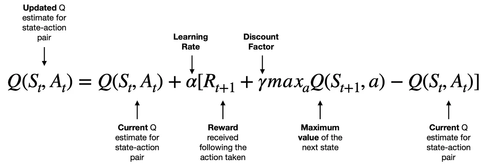
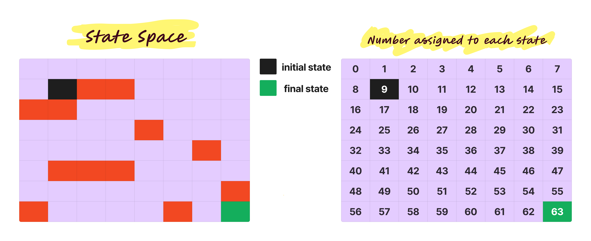
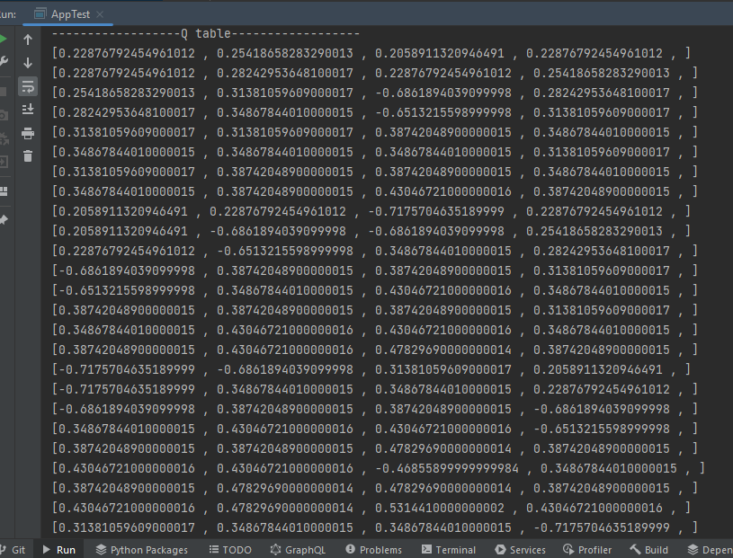
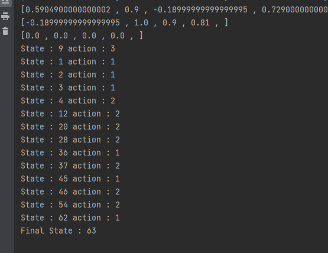
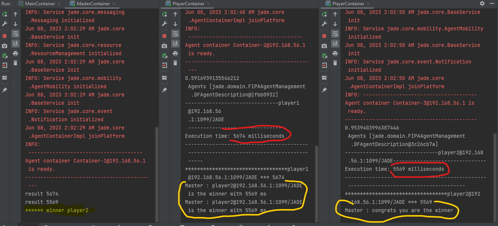

<h1>Distributed multi-agent system and AI </h1>
<h2 style="color: antiquewhite">QLearning algorithm implementation using MAS</h2>

  Asmae EL HYANI  Distributed System & Artificial Intelligence Master degree student  ENSET Mohammedia

   

    
<ol type="I">
<h2><li >About Algorithm</li></h2>
<h5>Update Q value</h5>

<pre>
Q — Q-function
𝑆𝑡 — current state(observation)
𝐴𝑡 — current action
𝑅𝑡+1 — reward received following current action
𝑆𝑡+1 — next state(observation)
𝛼 (alpha) — learning rate parameter
𝛾 (gamma) — discount factor parameter
𝑚𝑎𝑥𝑎𝑄(𝑆𝑡+1,𝑎) — maximum value for the next state(observation) across the possible action space</pre>

  <h2><li >Sequential implementation </li></h2>
<h4>Q table 8*8=64 states</h4>

<h4>Final result</h4>

<h2><li >MAS implementation</li></h2>

</ol>